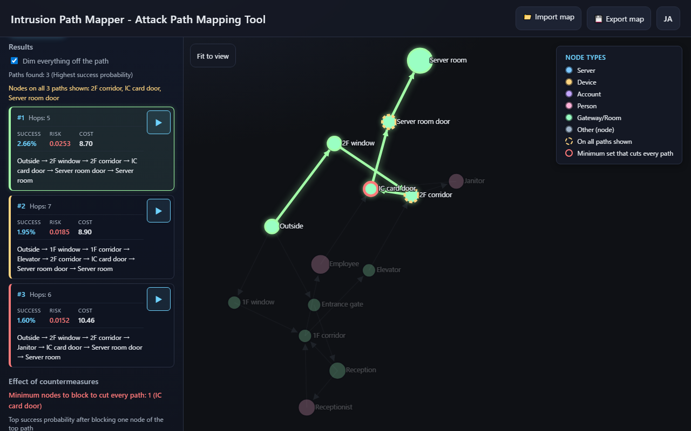
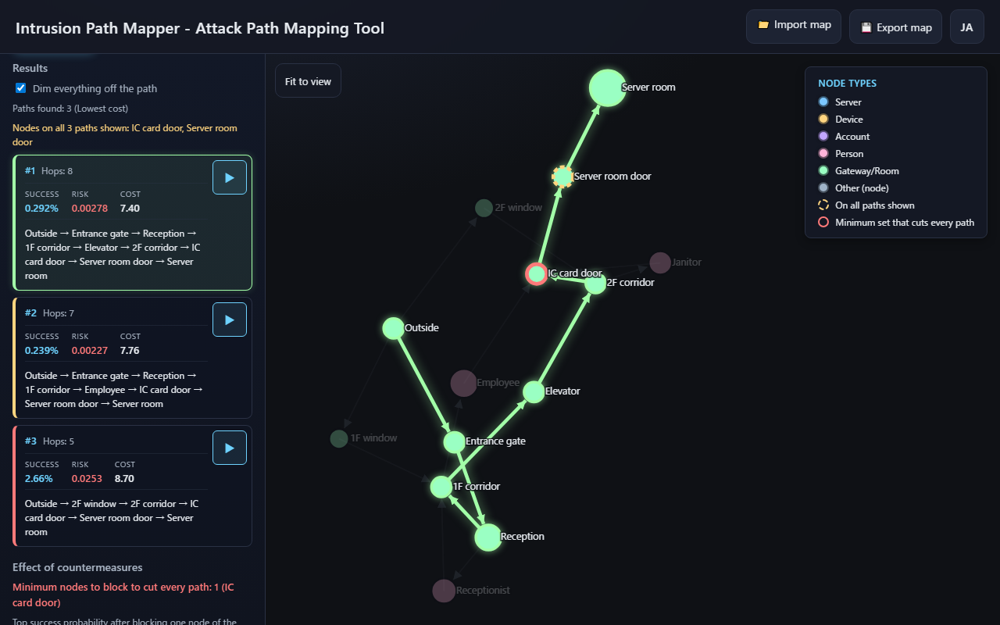
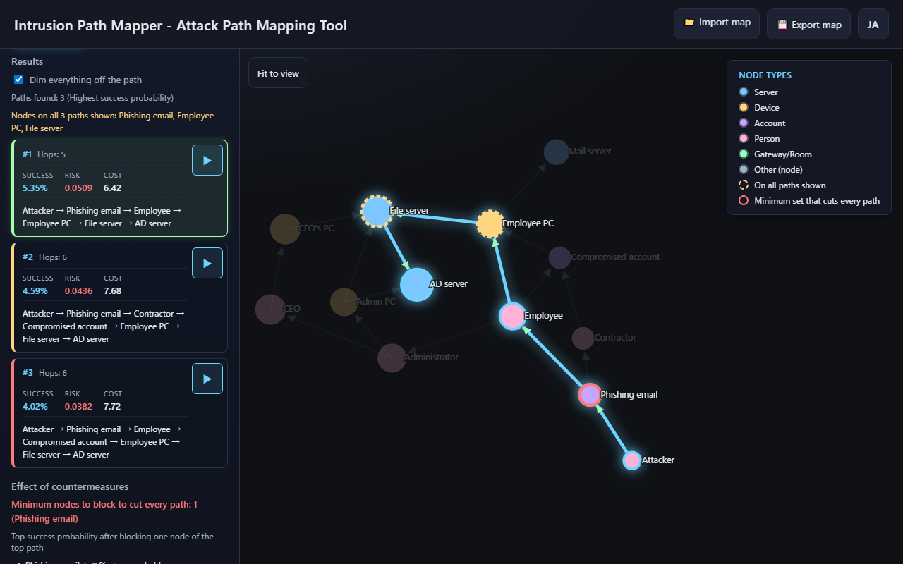
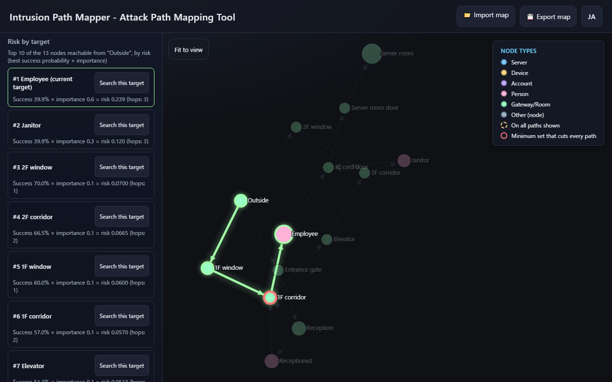
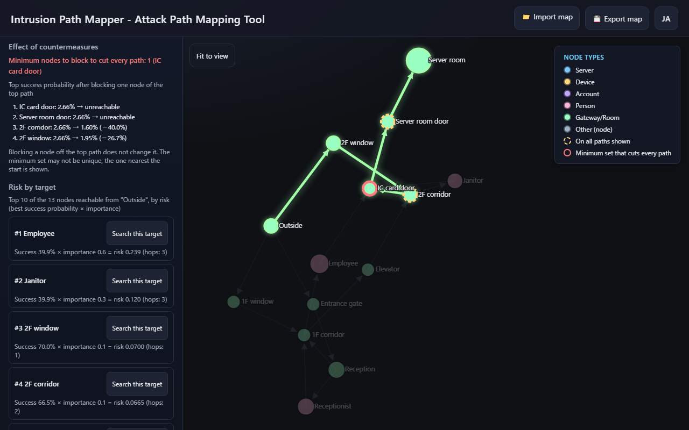
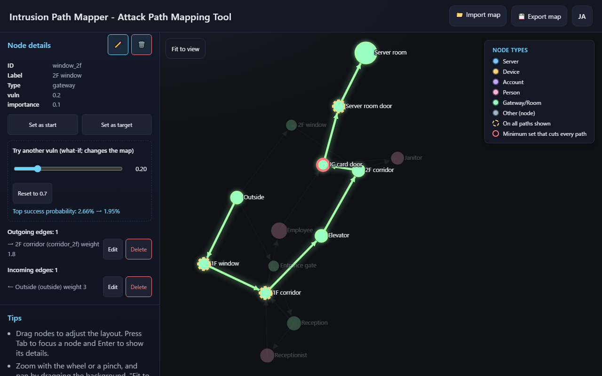

English · [日本語](README.md)

# Intrusion Path Mapper - Attack Path Mapping Tool


[](https://ipusiron.github.io/intrusion-path-mapper/)

**Day083 - 100 Security Tools with Generative AI**

**Intrusion Path Mapper** is an educational tool that maps buildings or networks as nodes and edges, then finds and visualizes an attacker's intrusion paths in the browser.

Give each node the probability that it can be breached (vuln), and the tool ranks the paths by success probability and shows the success probability and risk of each one. You can also rank them by cost, which uses how easy each move is (weight), and see why the two rankings disagree.

Physical security and cybersecurity fit on one map. All data is processed in the browser and never sent anywhere.

---

## 🌐 Demo

👉 **[https://ipusiron.github.io/intrusion-path-mapper/](https://ipusiron.github.io/intrusion-path-mapper/)**

Try it directly in your browser.

---

## 📸 Screenshots

>
>
>*By success probability; dashed rings are on all three paths*

>
>
>*Ordered by lowest cost, the front-door path comes first*

>
>
>*After the animation, nodes outside the path are dimmed*

>
>
>*Risk by target: the employee ranks above the server room*

>
>
>*Countermeasures: the IC card door alone cuts every path*

>
>
>*What-if: with the 2F window at 0.2, the 1F window path comes first*

---

## ✨ Features

- Find the top K paths (1 to 10) in two orders
  - Highest success probability (default): Yen's K shortest paths with `−ln(vuln)` as the edge weight, which gives the paths with the largest product of probabilities, exactly
  - Lowest cost: the smallest sum of `weight + node difficulty weight × (1 − vuln)`
- Show the success probability, risk, cost and hops of each path (three significant digits instead of rounding to 0.0%)
- Highlight the selected path on the map and step through it with the ▶ button. Everything off the path can be dimmed
- Mark the nodes that all paths shown pass through with dashed rings and list them in the results
- Risk by target: for every node reachable from the start, compute the best success probability × importance and list the top 10 (the current target is added at the end even when it ranks 11th or lower)
- Effect of countermeasures: mark the minimum set of nodes that cuts every path (a minimum vertex cut) with red rings, and list the top success probability after blocking each node of the top path
- What-if: move a node's vuln with a slider to recompute the paths, the countermeasures and the risk by target on the spot, and see how the top success probability changes (you can reset it)
- Add, edit and delete nodes and edges in the browser (nodes: type, vuln, importance, color and English label; edges: weight. The reverse edge can be added at the same time)
- Import and export JSON (the file is validated on import and every fix is reported)
- Four preset scenarios (facility intrusion, office network, physical intrusion, social engineering)
- Zoom with the wheel or a pinch, pan by dragging the background, and "Fit to view" to bring the whole map back
- Switch between Japanese and English (the sample nodes have English labels too)
- Keyboard support (Tab to focus a node, Enter to show its details, Esc to close the popup and dialogs)
- No horizontal overflow even on a 320 px wide phone

---

## 📖 Usage

### Basic flow

1. Prepare a map
   - Choose a scenario under "Presets" and press "Load preset"
   - Or load your own JSON file with "📁 Import map"
2. Find paths
   - Choose the "Entry point" (where the attack starts) and the "Target"
   - Choose "Order by" and "Number of paths K" (the cost order also uses "Node difficulty weight")
   - Press "Find paths"
3. Read the results
   - Click a path to highlight it on the map ("Dim everything off the path" dims the rest)
   - Nodes with a dashed ring are on all paths shown
   - Press ▶ to step from the start to the target
   - Use "Effect of countermeasures" to see the minimum set that cuts every path and the effect of blocking one node
   - Use "Risk by target" to compare the risk of other nodes as targets, and "Search this target" to switch the target
   - Move the slider in the node details to change vuln and watch the top success probability (this changes the map; "Reset to" restores it)
4. Edit the map (optional)
   - Add elements with "+ Add node" and "+ Add edge" ("Also add the reverse edge" makes a two-way edge)
   - Click a node and use "✏️" to edit or "🗑️" to delete it. "Set as start" and "Set as target" in the node details fill the selectors
   - Edit or delete an edge by clicking its line on the map, or from the "Outgoing edges" and "Incoming edges" lists in the node details
   - Save the map as JSON with "💾 Export map"

Editing the map clears the previous results, because old paths no longer match the new map. Switching the language only changes the display language; the results are not recalculated.

### Running locally

The tool uses ES modules, so it does not run from `file://`. Serve it over HTTP.

```bash
git clone https://github.com/ipusiron/intrusion-path-mapper.git
cd intrusion-path-mapper
python -m http.server 8000
```

Open `http://localhost:8000/` in your browser. Add `?lang=ja` or `?lang=en` to choose the language.

---

## 📐 Screen Layout

| Area | Contents |
|---|---|
| Header | Import, export and language switch |
| Sidebar | Presets, analysis settings and results, editing, node details, tips |
| Map | Nodes and edges, legend, "Fit to view" button, node popup |

At 860 px wide or less, the page becomes a single column with the map on top and the sidebar below. On wider screens, only the sidebar scrolls and the map stays in view.

---

## 🔬 Technical notes

### vuln and success probability

A node's `vuln` is the probability that an attacker at the previous node gets through (passes or takes over) this node. The attacker is already at the start node, so the start node's vuln is not counted.

- Success probability = the product of vuln over the nodes on the path, excluding the start node
- Example: from the start node through three nodes with vuln 0.8, 0.8 × 0.8 × 0.8 = 51.2%
- Breaching each node is assumed to be independent of the others

Rough guide for vuln (illustrative values):

| vuln | Guide |
|---|---|
| 1.00 | Starting point (where the attacker already is) |
| 0.90-0.95 | Passages and open areas anyone can use (corridor, lobby, elevator) |
| 0.50-0.80 | Authentication or locks that are often bypassed (tailgating, phishing) |
| 0.20-0.40 | Strong defenses (server room door, AD server) |
| 0 | Impassable (never used in the success-probability order) |

### Risk

Risk = success probability × importance of the target node (likelihood × impact). importance is the damage if the node is taken over, so passages such as doors and windows get low values. Among paths to the same target it follows the success probability, so it is used to compare different targets.

### Risk by target

One run of Dijkstra's algorithm with `−ln(vuln)` weights gives the best success probability from the start node to every node at once. Each value is multiplied by the node's importance and the nodes are sorted by risk. In the physical intrusion map (from Outside), the employee ranks first (39.9% × 0.6 = 0.239), while the most important server room (2.66% × 0.95 = 0.0253) ranks 11th.

### Two orders

A success probability is a product, so it does not fit a shortest-path algorithm as it is. The logarithm of a product is a sum, so if each edge weighs `−ln(vuln)` of the node it enters, the path with the smallest total weight is the path with the largest success probability. Yen's algorithm then finds the top K paths.

In the lowest-cost order, an edge weighs `weight + node difficulty weight × (1 − vuln of the node it enters)`. It adds how easy the move is (weight) to how easy the breach is, and it is a different quantity from the success probability.

The two rankings can disagree. In the physical intrusion map (default start and target, K=3), the cheapest path enters from the front (Outside→Entrance gate→Reception→1F corridor→Elevator→2F corridor→IC card door→Server room door→Server room, success probability 0.292%). The most likely path enters through the 2F window (Outside→2F window→2F corridor→IC card door→Server room door→Server room, 2.66%), about nine times the front-door path.

### K paths (Yen's algorithm)

Yen's algorithm (1971) finds K loopless paths in order of length. It finds the first path with Dijkstra's algorithm, and for each next path it branches off from the nodes of the previous path and picks the shortest candidate. Dijkstra's algorithm uses a binary heap. The tests check that, for every start and target pair in the four samples, the results match a brute-force enumeration of all simple paths.

### Nodes on all paths shown

When two or more paths are shown, the nodes that every path passes through (other than the start and the target) get a dashed ring. In the physical intrusion map (by success probability) they are 2F corridor, IC card door and Server room door for K=3, and IC card door and Server room door for K=5 and K=10. This is about the K paths shown, so blocking such a node does not necessarily cut every path (the set that cuts every path is found in "Effect of countermeasures" below).

### Effect of countermeasures (blocking one node and the minimum vertex cut)

Each node in the middle of the top path is blocked in turn, and the resulting top success probability is listed. Blocking a node that is not on the top path leaves the top path as it is, so only the nodes in the middle of the top path need to be checked. In the physical intrusion map, blocking the 2F corridor drops the top to 1.60% (−40.0%), the 2F window to 1.95% (−26.7%), and blocking the IC card door or the server room door makes the target unreachable.

The minimum set of nodes that cuts every path (a minimum vertex cut) comes from a maximum flow in which each node is split into an entry and an exit joined with capacity 1 (by Menger's theorem, the maximum number of paths that share no node equals the minimum number of nodes needed to cut them). The minimum set is not always unique, so the one closest to the start is shown. In all four samples it is a single node: Entrance for facility intrusion, Firewall for the office network attack, IC card door for physical intrusion and Phishing email for social engineering.

### What-if (moving vuln)

Moving vuln with the slider in the node details recomputes the paths, the countermeasures and the risk by target with the conditions of the last search (start, target, order and K), and shows "Top success probability: before → after". In the physical intrusion map, lowering the vuln of the 2F window from 0.7 to 0.2 changes the top path to Outside→1F window→1F corridor→Elevator→2F corridor→IC card door→Server room door→Server room, and the success probability from 2.66% to 1.95%. It changes the value in the map itself, so it is also exported. "Reset to" restores it.

### Preset scenarios

The default start is the node with no incoming edges, and the default target is the first entry of `attack_goals`. The success probability column is the value of the top path in the success-probability order.

| Scenario | Nodes | Edges | Start→Target | Top success probability |
|---|---|---|---|---|
| Facility intrusion (simple) | 6 | 6 | ext→srv1 | 5.85% |
| Office network attack | 10 | 14 | internet→ad_server | 1.57% |
| Physical intrusion | 14 | 18 | outside→server_room | 2.66% |
| Social engineering | 13 | 17 | attacker→ad_server | 5.35% |

### JSON format

```json
{
  "meta": { "title": "Sample Facility", "author": "ipusiron", "created_at": "2025-10-01" },
  "nodes": [
    { "id": "ext",  "type": "gateway", "label": "外部", "label_en": "Outside", "vuln": 1.0, "importance": 0.1 },
    { "id": "srv1", "type": "server",  "label": "ファイルサーバー", "label_en": "File server", "vuln": 0.5, "importance": 0.9 }
  ],
  "edges": [
    { "source": "ext", "target": "srv1", "weight": 1.2 }
  ],
  "attack_goals": ["srv1"]
}
```

Nodes (nodes)
- `id` (required): 1-100 letters, digits, underscores or hyphens. Must be unique
- `label`: display name (up to 200 characters; defaults to the id)
- `label_en`: name shown in the English UI (optional, up to 200 characters)
- `type`: `gateway`, `device`, `server`, `account`, `room`, `person` or `node`. Custom types made of lowercase letters, digits, `_` and `-` also work (they get the `node` color)
- `vuln`: probability of getting through (0-1, defaults to 0.5)
- `importance`: damage if the node is taken over (its value as an asset; 0-1, defaults to 0.5. Give passages such as doors and windows low values)
- `color` (optional): custom color in the form `#rrggbb`

Edges (edges)
- `source` and `target` (required): node ids. Edges are directed (from source to target)
- `weight`: traversal cost (0 or more, defaults to 1). Used for the cost order

Other fields
- `meta`: `title`, `title_en`, `author` and `created_at` (up to 200 characters each)
- `attack_goals`: ids of the default targets (the first one is used)

Import limits are 5 MB per file, 1,000 nodes and 5,000 edges. Files with a malformed, duplicated or too long ID, or that are not valid JSON, are rejected. Out-of-range vuln, negative weights, edges to missing nodes, self-loops and duplicate edges are fixed or dropped, the file is loaded, and the fixes are listed at the top of the sidebar. An exported file can be imported again as it is.

### Node types and example values

| Type | Color | Represents | Examples (rough vuln) |
|---|---|---|---|
| gateway | Green | Boundaries and entrances | Internet (start) 1.00, firewall 0.25, wireless AP 0.70, VPN gateway 0.35, window 0.60 |
| device | Yellow | Devices | Sales PC 0.80, accounting PC 0.70, CEO's PC 0.40, kiosk terminal 0.75, IoT device 0.85 |
| server | Blue | Servers and cloud services | File server 0.50, AD server 0.30, DB server 0.35, web server 0.55 |
| account | Purple | Accounts and credentials | Domain admin 0.40, shared account 0.80, API key 0.70, SSH private key 0.55 |
| room | Green | Rooms and passages | Corridor 0.95, lobby 0.90, elevator 0.90, IC card door 0.50, server room door 0.40 |
| person | Pink | People (targets of social engineering) | Attacker (start) 1.00, receptionist 0.60, janitor 0.60, employee 0.70, CEO 0.40 |
| node | Gray | Anything else | Custom types also get this color |

As a guide for edge weights: 0.5 = open and easy, 1.0 = standard, 2.0 = multi-factor authentication or a physical barrier, 5.0 = tight security.

---

## 🎯 Use Cases

Ways of using this tool in particular
- Put "the cheapest path" and "the easiest path" side by side: facility staff or students rank the same map by lowest cost and by highest success probability and discuss why the top path changes. In the physical intrusion map, the path through the 2F window (2.66%) is about nine times easier than the front-door path (0.292%)
- If you can watch only one spot: draw a floor plan of your home or a small office and look at the minimum set in "Effect of countermeasures" and at the dashed rings that stay as K grows. In the physical intrusion map, the minimum set is the IC card door alone, and the IC card door and the server room door remain even at K=10, so either is a candidate for a single camera or alarm (the minimum set is not always unique)
- Read attack paths as dependency paths and look for single points of failure: model an approval chain (request → manager → director → accounting) or a supply chain (parts → factory → warehouse → store) as nodes, with vuln as the probability that each stage works. The success probability becomes the probability of getting all the way through, and the dashed rings become single points of failure that stop everything when they stop (failures are assumed to be independent; capacity and time are not modeled)
- A defense budget game (tabletop exercise): the attack side builds a map, and the defense side spends a budget of 10 points, one point per 0.1 lowered vuln. Each move of the what-if slider updates "Top success probability: before → after", so the defense competes on how far it can lower the top path and sees another path take first place as soon as one path is hardened. The blocking table in "Effect of countermeasures" hints where to spend the budget
- The riskiest node is not always the most important asset: use risk by target to decide what to protect first. In the physical intrusion map (from Outside), the easy-to-reach employee ranks first (39.9% × 0.6 = 0.239), while the most important server room (2.66% × 0.95 = 0.0253) ranks 11th. This is material for discussing whether to train people before hardening equipment
- Read it as information: `−ln(vuln)` is the self-information (in nats) of an event with probability vuln, so the top path in the success-probability order is the path with the smallest total surprise. The top path of the physical intrusion map totals 3.63 nats (5.23 bits), and its last step (the server room, vuln 0.2) accounts for 1.61 nats. Learning self-information first with [InfoQuantity Academy](https://ipusiron.github.io/infoquantity-academy/) (Day073) shows how the two ideas connect

Education
- In an information security class, students turn a floor plan of their school into nodes and edges and explain, with a product of probabilities, why "the cheapest way in" and "the most likely way in" are different paths
- In an algorithms class, students compare hand calculations with the tool to check the K paths from Yen's algorithm and the logarithm trick that turns a product into a sum
- In a probability class, students read from paths with different numbers of hops how quickly a product of independent events shrinks

Work (outside security)
- Facility managers and general affairs staff draw the routes of visitors, cleaners and deliveries, change the vuln of the reception desk or doors, and compare where the easiest path moves, as material for discussing guard placement (the values are the staff's estimates and do not replace an on-site assessment)
- Internal auditors and risk managers model an approval flow from request to payment as nodes and list the paths that fraud could take

Home and family
- When reviewing home security, the family makes the front door, windows, back door and balcony into nodes and checks where the easiest way in moves when an extra lock lowers a vuln
- Draw how the family's email, cloud and phone accounts connect, see how far a hijacked email account reaches, and decide the order for turning on two-step verification

Hobbies and creative work
- When writing a mystery or an escape game, list intrusion paths from a mansion's floor plan and look for a back way that readers or players are unlikely to notice
- When designing a dungeon for a tabletop RPG or a board game, tune where the easy routes and the hard spots go while watching the success probabilities

Research
- As an introduction to attack-graph research, turn a model from a paper into a small JSON file and try how paths are counted and ranked
- Load an exported JSON file into Python's NetworkX or similar and check with your own calculation that you get the same paths and success probabilities

Combining with other tools
- Turn the assets listed with [Asset Inventory Helper](https://ipusiron.github.io/asset-inventory-helper/) (Day059) into nodes and check the paths to the important ones
- After learning how ports and services look in [Port Scan Visualizer](https://ipusiron.github.io/port-scan-visualizer/) (Day062), map the path from the outside to a server
- Copy the keys and doors managed in [Physical Key Ledger](https://ipusiron.github.io/physical-key-ledger/) (Day087) into the nodes and vuln of a physical intrusion map

Limitations
- Probabilities are assumed to be independent for each node. In reality breaches can be linked, for example when one credential opens several doors
- vuln, importance and weight are the user's estimates, and the tool does not guarantee that they are right
- Time is not modeled, such as how long until detection or until guards arrive

---

## 🧪 Tests

```bash
npm test
```

- Runs on Node.js 22 or later with no dependencies (`node --test`)
- GitHub Actions runs it on every push and pull request
- Logic (`js/ipm-core.js`): validation and normalization, export and re-import round trips, Yen's algorithm matching a brute-force enumeration of all simple paths (cost order and success-probability order), risk by target matching the brute force, blocking one node matching the brute force, the minimality of the minimum vertex cut (every pair of every sample), adding, editing and deleting edges, metrics and display digits
- Page and documents: CSP and HTML structure, SHA-256 of the self-hosted D3, color contrast (4.5:1 or more), matching Japanese and English dictionaries with no Japanese in the English strings, README numbers and directory structure

---

## 🔒 Security

- A CSP in a meta element limits scripts, styles and connections to the same origin (`'self'`), with no `'unsafe-inline'`
- D3.js 7.9.0 is self-hosted in `vendor/d3/` (no external CDN; the tests check the file's SHA-256)
- Labels and IDs from imported files are drawn with `textContent` (never parsed as HTML)
- Imported JSON is used only after its ID format, duplicates, lengths, value ranges and counts are validated
- Nothing is sent outside. The only thing stored in the browser is the language choice (localStorage)
- `referrer` is `no-referrer`, and external links use `noopener noreferrer`

Limitations
- GitHub Pages cannot set response headers. `frame-ancestors` does not work in a meta CSP, so the page cannot prevent being framed by other sites
- Check JSON files received from people you do not trust before importing them

---

## ⚠️ Notes

- This tool is an aid for learning and discussion. It does not replace a security assessment of a real organization
- Do not enter detailed layouts or confidential information about real organizations, facilities or networks. When you share a map, leave personal names and room numbers out of the labels
- The author does not encourage using this tool to break into other people's systems or facilities
- The developer is not liable for any damage caused by using this tool

---

## 🔗 References

- Jin Y. Yen, "Finding the K Shortest Loopless Paths in a Network," Management Science, Vol. 17, No. 11, pp. 712-716, 1971
- NIST SP 800-30 Rev. 1, "Guide for Conducting Risk Assessments," 2012 (determining risk from likelihood and impact)
- Oleg Sheyner, Joshua Haines, Somesh Jha, Richard Lippmann, Jeannette M. Wing, "Automated Generation and Analysis of Attack Graphs," IEEE Symposium on Security and Privacy, 2002
- [D3.js](https://d3js.org/) (d3-force, d3-drag, d3-zoom)

---

## 👨‍💻 For developers

For the internals (logic API, algorithms and how the page is built), see [DEVELOPER.md](DEVELOPER.md) (in Japanese).

---

## 📁 Directory Structure

```
intrusion-path-mapper/
├── .github/                              # GitHub settings
│   └── workflows/                        # GitHub Actions workflows
│       └── test.yml                      # Runs npm test on push and pull request
├── assets/                               # Screenshots
│   ├── en/                               # English screens
│   │   ├── screenshot.png                # Physical intrusion by highest success probability
│   │   ├── screenshot2.png               # The same map by lowest cost
│   │   ├── screenshot3.png               # After a path animation finished
│   │   ├── screenshot4.png               # Risk by target
│   │   ├── screenshot5.png               # Effect of countermeasures and the minimum set
│   │   └── screenshot6.png               # What-if slider lowering a vuln
│   ├── screenshot.png                    # Japanese: physical intrusion by highest success probability
│   ├── screenshot2.png                   # Japanese: the same map by lowest cost
│   ├── screenshot3.png                   # Japanese: after a path animation finished
│   ├── screenshot4.png                   # Japanese: risk by target
│   ├── screenshot5.png                   # Japanese: effect of countermeasures and the minimum set
│   └── screenshot6.png                   # Japanese: what-if slider lowering a vuln
├── css/                                  # Stylesheets
│   └── style.css                         # Colors, layout and responsive rules
├── js/                                   # JavaScript
│   ├── ipm-core.js                       # Logic (validation, normalization, Yen's algorithm, metrics; no DOM)
│   ├── ipm-messages.js                   # UI strings (Japanese and English)
│   └── main.js                           # Page logic (D3 drawing, interaction, editing, language switch)
├── sample-data/                          # Preset scenarios
│   ├── sample-facility.json              # Facility intrusion (simple)
│   ├── sample-office-network.json        # Office network attack
│   ├── sample-physical-intrusion.json    # Physical intrusion
│   └── sample-social-engineering.json    # Social engineering
├── test/                                 # Automated tests (node --test)
│   ├── contrast.test.js                  # Color contrast
│   ├── core.test.js                      # Logic
│   ├── format.test.js                    # Line length, line counts and control characters
│   ├── html.test.js                      # CSP, HTML structure and self-hosted D3
│   ├── i18n.test.js                      # Dictionaries and English labels of the samples
│   └── readme.test.js                    # README structure, numbers and directory structure
├── vendor/                               # Self-hosted libraries
│   └── d3/                               # D3.js
│       ├── LICENSE                       # D3.js license (ISC)
│       └── d3.v7.9.0.min.js              # D3.js 7.9.0
├── .gitattributes                        # Keeps line endings in vendor/ unchanged
├── .gitignore                            # Files Git does not track
├── .nojekyll                             # Turns off Jekyll on GitHub Pages
├── CLAUDE.md                             # Development notes for Claude Code
├── DEVELOPER.md                          # Developer documentation (Japanese)
├── LICENSE                               # MIT License
├── README.en.md                          # This file
├── README.md                             # Japanese README
├── index.html                            # HTML of the page
└── package.json                          # npm test settings (no dependencies)
```

---

## 💻 Requirements

- Latest Chrome, Edge, Firefox or Safari (a browser that supports ES modules and the `<dialog>` element)
- Must be served over HTTP (does not run from `file://`)
- Node.js 22 or later for the tests

---

## 📄 License

- The source code is under the [MIT License](LICENSE)
- Uses [D3.js](https://d3js.org/) (ISC License, `vendor/d3/LICENSE`)

---

## 🛠️ About this tool

This tool was developed as part of the "100 Security Tools with Generative AI" project.
In this project, a variety of security-related tools are created and published over 100 days with the help of AI.

For details and the other tools, see the page below.

🔗 [https://akademeia.info/?page_id=42163](https://akademeia.info/?page_id=42163)
