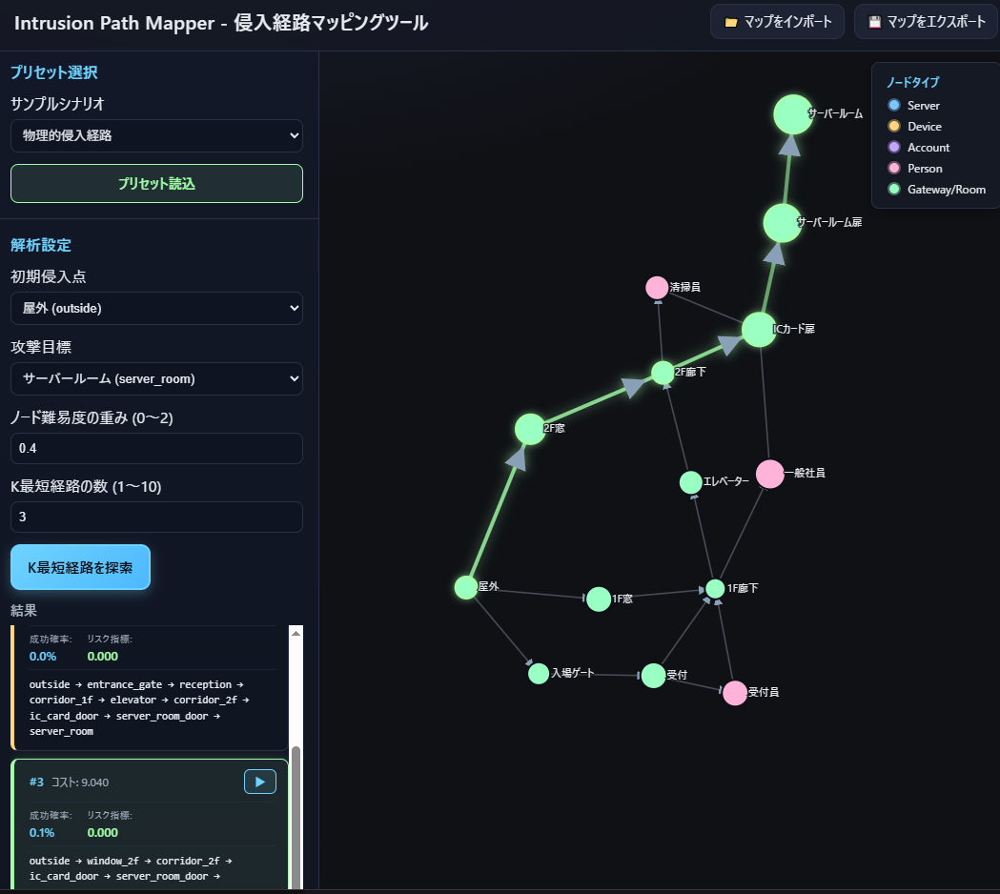

<!--
---
title: Intrusion Path Mapper
category: attack-path
difficulty: 2
description: Interactive tool to simulate and visualize intrusion paths in simplified facility or network maps. Built with D3.js, runs entirely client-side.
tags: [attack-path, visualization, d3, education, javascript]
demo: https://ipusiron.github.io/intrusion-path-mapper/
---
-->

# Intrusion Path Mapper – 侵入経路マッピングツール


[](https://ipusiron.github.io/intrusion-path-mapper/)

**Day083 - 生成AIで作るセキュリティツール100**

**Intrusion Path Mapper** は、建物やネットワークの簡易マップを入力し、ブラウザー上で攻撃者の「侵入経路」をシミュレーション・可視化する教育用ツールです。

Yen's K-shortest pathsアルゴリズムにより複数の侵入ルート候補を発見し、各経路の成功確率とリスク指標を自動計算します。

物理セキュリティとサイバーセキュリティを統合的にモデル化でき、レッドチーム演習やセキュリティ対策の検討に活用できます。

---

## 🌐 デモページ

👉 **[https://ipusiron.github.io/intrusion-path-mapper/](https://ipusiron.github.io/intrusion-path-mapper/)**

ブラウザーで直接お試しいただけます。

---

## 📸 スクリーンショット

>
>*物理的侵入経路を探索*

---

## 🎯 本ツールの対象

- **セキュリティ教育・研修を実施したい方**
  - 攻撃経路の考え方を視覚的に学習
  - レッドチーム演習のシミュレーション
  - セキュリティ意識向上のためのデモ資料作成

- **セキュリティ対策を検討している組織**
  - 施設やネットワークの脆弱性を可視化
  - 複数の侵入シナリオを比較検討
  - リスク評価とセキュリティ投資の優先順位付け

- **レッドチーム・ペネトレーションテスター**
  - 攻撃経路の事前調査とプランニング
  - 複数の侵入ルート候補の探索
  - 攻撃の成功確率とリスク指標の見積もり

- **セキュリティ研究者・学生**
  - 攻撃グラフ理論の学習と実験
  - 経路探索アルゴリズムの動作確認
  - サイバーセキュリティと物理セキュリティの統合モデリング

---

## ✨ 主な機能

- **完全クライアントサイド** なので、データはブラウザー内のみで処理され、外部に送信されません。
- **D3.js v7** によるインタラクティブなグラフ描画とドラッグ操作。
- **Yen's K-shortest paths アルゴリズム** で複数の侵入経路候補を発見。
- **リスク指標と成功確率** を自動計算し、経路ごとに評価。
- **経路アニメーション** で攻撃の進行を視覚的にシミュレート。
- **ノード/エッジの編集機能** でブラウザー上で直接マップを作成・修正可能。
- **4種類のプリセットシナリオ** を用意（施設侵入、オフィスネットワーク、物理侵入、ソーシャルエンジニアリング）。
- 結果はSVGグラフ上でハイライト表示され、JSON形式でインポート/エクスポート可能。

---

## 📖 使い方

### 基本的な使い方

1. **プリセットシナリオを読み込む**
   - サイドバー最上部の「プリセット選択」から4種類のシナリオを選択
   - 「プリセット読込」ボタンでサンプルマップを読み込み
   - または、「📁 マップをインポート」で独自のJSONファイルを読み込み

2. **侵入経路を解析する**
   - 「初期侵入点」（攻撃の開始地点）を選択
   - 「攻撃目標」（攻撃の最終目的地）を選択
   - 「ノード難易度の重み」と「K最短経路の数」を調整（任意）
   - 「K最短経路を探索」ボタンをクリック

3. **結果を確認する**
   - 複数の侵入経路候補がランク付けされて表示
   - 各経路の**成功確率**と**リスク指標**を確認
   - 経路をクリックして選択、グラフ上でハイライト表示
   - **▶ボタン**で経路アニメーションを再生

4. **マップを編集する（任意）**
   - 「+ ノード追加」「+ エッジ追加」で要素を追加
   - ノードをクリックして「✏️編集」「🗑️削除」
   - ノードをドラッグして配置を調整
   - 「💾 マップをエクスポート」で保存

---

## 🎬 プリセットシナリオ

| シナリオ名 | ノード数 | 説明 |
|---|---|---|
| **施設侵入（シンプル）** | 6 | 基本的な施設侵入経路（初心者向け） |
| **オフィスネットワーク攻撃** | 10 | インターネットからADサーバーへの攻撃経路 |
| **物理的侵入経路** | 14 | 屋外からサーバールームまでの物理侵入 |
| **ソーシャルエンジニアリング** | 13 | フィッシングから社長PCまでの攻撃チェーン |

---

## ⚙️ 主要機能

### 1. K-最短経路探索（Yen's Algorithm）

- 初期侵入点から攻撃目標までの**複数の経路候補**を発見
- 各経路のコスト（難易度）を計算して順位付け
- 最大10経路まで探索可能

### 2. リスク評価指標

各経路について以下の指標を自動計算:

- **成功確率**: 経路上の各ノードの脆弱性（vuln）の積
  - 例: vuln=0.8のノード3つ → 成功確率 = 0.8³ = 51.2%

- **リスク指標**: `成功確率 × 最大重要度 × (1/√経路長)`
  - 短く、脆弱で、重要な資産を含む経路ほど高リスク

### 3. 経路アニメーション

- ▶ボタンで攻撃の進行をステップバイステップで可視化
- 現在位置をハイライト、次の候補を点線で表示
- 経路外の要素を暗く表示して焦点を明確化

### 4. インタラクティブな編集

- **ノード追加**: ID、タイプ、脆弱性、重要度、カスタム色を設定
- **エッジ追加**: 2つのノード間の移動コスト（weight）を設定
- **ドラッグ操作**: ノードをドラッグしてレイアウトを自由に調整
- **リアルタイム反映**: 編集内容は即座にグラフに反映

---

## 📋 JSONフォーマット例

```json
{
  "meta": {
    "title": "Sample Facility",
    "author": "ipusiron",
    "created_at": "2025-10-01"
  },
  "nodes": [
    { "id": "ext",  "type": "gateway", "label": "外部", "vuln": 0.3, "importance": 0.1 },
    { "id": "srv1", "type": "server",  "label": "ファイルサーバー", "vuln": 0.5, "importance": 0.9 }
  ],
  "edges": [
    { "source": "ext", "target": "srv1", "weight": 1.2 }
  ],
  "attack_goals": ["srv1"]
}
```

### フィールド説明

**ノード (nodes)**
- `id` (必須): 英数字、アンダースコア、ハイフン（最大100文字）
- `label`: 表示名（最大200文字、未指定時はidを使用）
- `type`: `gateway`, `device`, `server`, `account`, `room`, `person`
- `vuln`: 脆弱性 (0.0〜1.0、大きいほど攻撃成功しやすい)
- `importance`: 重要度 (0.0〜1.0、大きいほど重要な資産)
- `color` (任意): カスタムカラーコード（例: `#ff0000`）

**エッジ (edges)**
- `source` (必須): 開始ノードのID
- `target` (必須): 終了ノードのID
- `weight`: 移動コスト（小さいほど容易、デフォルト1.0）

**メタデータ (meta)** ※任意
- `title`: マップのタイトル
- `author`: 作成者
- `created_at`: 作成日

---

## 🔷 ノードの種類と活用例

このツールでは、物理的な侵入経路とネットワーク上の攻撃経路を統合してモデル化できます。以下、全6種類のノードタイプごとに具体例を示します。

---

### 1. Gateway（ゲートウェイ） - 境界・入口ノード

外部と内部を繋ぐ境界点や、ネットワークの入口となる機器を表現します。

| ID | Label | Type | Vuln | Importance | 説明 |
|---|---|---|---|---|---|
| `internet` | インターネット | gateway | 0.40 | 0.10 | 外部ネットワーク |
| `entrance_gate` | 入場ゲート | gateway | 0.30 | 0.20 | 施設への主要入口 |
| `window` | 窓 | gateway | 0.60 | 0.40 | 物理的侵入口 |
| `firewall` | ファイアウォール | gateway | 0.25 | 0.60 | ネットワーク境界機器 |
| `router` | ルーター | gateway | 0.40 | 0.70 | ネットワーク境界 |
| `network_switch` | ネットワークスイッチ | gateway | 0.50 | 0.60 | L2/L3スイッチ |
| `wireless_ap` | 無線AP | gateway | 0.70 | 0.60 | Wi-Fiアクセスポイント |
| `vpn_gateway` | VPNゲートウェイ | gateway | 0.35 | 0.75 | リモートアクセス入口 |

**色**: 緑系 (#9affc3)

---

### 2. Device（デバイス） - エンドポイント

PCやスマートフォンなど、エンドユーザーが直接操作する端末を表現します。

| ID | Label | Type | Vuln | Importance | 説明 |
|---|---|---|---|---|---|
| `sales_pc` | 営業部PC | device | 0.80 | 0.50 | 外部接続が多い |
| `accounting_pc` | 経理部PC | device | 0.70 | 0.80 | 財務情報アクセス |
| `admin_pc` | 管理部PC | device | 0.60 | 0.80 | 管理者権限保持 |
| `ceo_pc` | 社長PC | device | 0.40 | 1.00 | 最重要ターゲット |
| `employee_pc` | 社員PC | device | 0.60 | 0.60 | 一般社員の端末 |
| `kiosk_terminal` | 受付端末 | device | 0.75 | 0.40 | 公開エリアの端末 |
| `iot_device` | IoT機器 | device | 0.85 | 0.30 | スマート家電など |
| `mobile_phone` | 社用スマートフォン | device | 0.65 | 0.55 | モバイル端末 |

**色**: オレンジ系 (#ffd580)

---

### 3. Server（サーバー） - 重要システム

サーバーやクラウドサービスなど、重要なデータやサービスを提供するシステムを表現します。

| ID | Label | Type | Vuln | Importance | 説明 |
|---|---|---|---|---|---|
| `file_server` | ファイルサーバー | server | 0.50 | 0.90 | 機密ファイル保存 |
| `ad_server` | ADサーバー | server | 0.30 | 0.95 | ドメイン認証基盤 |
| `nas` | NAS | server | 0.50 | 0.85 | 共有ストレージ |
| `email_server` | メールサーバー | server | 0.45 | 0.70 | 社内メール基盤 |
| `db_server` | データベースサーバー | server | 0.35 | 0.95 | 顧客情報DB |
| `web_server` | Webサーバー | server | 0.55 | 0.60 | 公開Webサイト |
| `backup_server` | バックアップサーバー | server | 0.40 | 0.80 | データバックアップ |
| `dns_server` | DNSサーバー | server | 0.45 | 0.65 | 名前解決サービス |

**色**: 青系 (#7cc7ff)

---

### 4. Account（アカウント） - 論理的権限

ユーザーアカウントや認証情報など、論理的な攻撃対象を表現します。

| ID | Label | Type | Vuln | Importance | 説明 |
|---|---|---|---|---|---|
| `admin_account` | 管理者アカウント | account | 0.50 | 0.95 | システム管理者権限 |
| `domain_admin` | ドメイン管理者 | account | 0.40 | 1.00 | AD最高権限 |
| `service_account` | サービスアカウント | account | 0.65 | 0.70 | 自動化処理用 |
| `guest_account` | ゲストアカウント | account | 0.90 | 0.20 | 一時的な訪問者用 |
| `compromised_account` | 侵害アカウント | account | 0.75 | 0.50 | 既に侵害済み |
| `shared_account` | 共有アカウント | account | 0.80 | 0.60 | 複数人で共有 |
| `api_key` | APIキー | account | 0.70 | 0.65 | API認証情報 |
| `ssh_key` | SSH秘密鍵 | account | 0.55 | 0.75 | サーバーアクセス鍵 |

**色**: 紫系 (#c3a6ff)

---

### 5. Room（部屋・エリア） - 物理空間

建物内の部屋やエリア、物理的な移動経路を表現します。

| ID | Label | Type | Vuln | Importance | 説明 |
|---|---|---|---|---|---|
| `reception` | 受付 | room | 0.30 | 0.40 | フロント受付 |
| `lobby` | ロビー | room | 0.35 | 0.30 | 開放エリア |
| `corridor` | 廊下 | room | 0.10 | 0.10 | 移動経路 |
| `elevator` | エレベーター | room | 0.20 | 0.30 | 階層間移動 |
| `staircase` | 階段 | room | 0.15 | 0.20 | 非常階段含む |
| `ic_card_door` | ICカード扉 | room | 0.50 | 0.70 | ICカード認証ドア |
| `server_room` | サーバールーム | room | 0.20 | 0.95 | 物理サーバー設置室 |
| `office_room` | オフィス室 | room | 0.40 | 0.50 | 執務スペース |
| `meeting_room` | 会議室 | room | 0.45 | 0.35 | 会議スペース |
| `parking_lot` | 駐車場 | room | 0.60 | 0.25 | 地下駐車場など |

**色**: 緑系 (#9affc3)

---

### 6. Person（人物） - ソーシャルエンジニアリング対象

人間を介した攻撃経路（フィッシング、なりすまし、内部関係者など）を表現します。

| ID | Label | Type | Vuln | Importance | 説明 |
|---|---|---|---|---|---|
| `attacker` | 攻撃者 | person | 0.90 | 0.05 | 外部攻撃者 |
| `receptionist` | 受付員 | person | 0.60 | 0.40 | 情報漏洩リスク |
| `security_guard` | 警備員 | person | 0.40 | 0.50 | ソーシャルエンジニアリング対象 |
| `janitor` | 清掃員 | person | 0.60 | 0.30 | 物理的アクセス保持 |
| `contractor` | 契約社員 | person | 0.80 | 0.50 | アクセス権限が限定的 |
| `employee` | 一般社員 | person | 0.70 | 0.60 | フィッシング対象 |
| `admin_staff` | 管理者 | person | 0.50 | 0.90 | 高権限保持者 |
| `ceo` | 社長 | person | 0.40 | 1.00 | 最高権限者 |
| `hr_staff` | 人事担当 | person | 0.65 | 0.70 | 個人情報アクセス |
| `it_support` | IT担当者 | person | 0.55 | 0.85 | システム管理権限 |

**色**: ピンク系 (#ffb3d9)

### エッジ（経路）の重み付け

- **weight**: 移動コスト（小さいほど容易）
  - `0.5`: 非常に容易（開放エリア、パッチ未適用）
  - `1.0`: 標準的（通常の認証、一般的な防御）
  - `2.0`: 困難（多要素認証、物理的障壁）
  - `5.0`: 非常に困難（厳重な警備、強固な防御）

---

## ⚠️ 注意事項

### セキュリティとプライバシー

- **本ツールは教育・デモ目的専用**であり、実運用環境でのセキュリティ評価を代替するものではありません。
- **実際の組織・施設・ネットワーク構成を入力しないでください。** 機密情報や個人情報、実在するシステムの詳細情報を含めないでください。
- GitHub Pages上ではすべての処理がブラウザー内で完結し、**データは外部に送信されません**。
- JSONファイルのインポート時は、**信頼できるソースからのファイルのみ**を使用してください。

### 使用上の制限

- **ファイルサイズ制限**: 最大5MB
- **ノード数制限**: 最大1,000ノード
- **エッジ数制限**: 最大5,000エッジ
- **ID命名規則**: 英数字、アンダースコア、ハイフンのみ（最大100文字）
- **ラベル長**: 最大200文字

### 責任範囲

- このツールを使用して得られた結果は参考情報であり、実際のセキュリティ対策の計画には専門家による評価が必要です。
- 本ツールの使用により生じたいかなる損害についても、開発者は責任を負いません。

---

## 📁 ディレクトリー構成

```
intrusion-path-mapper/
├── index.html              # メインHTMLファイル
├── css/
│   └── style.css          # スタイルシート
├── js/
│   └── main.js            # メインロジック (Yen's K-shortest paths, D3.js可視化)
├── sample-data/           # プリセットシナリオ
│   ├── sample-facility.json              # 施設侵入（シンプル）
│   ├── sample-office-network.json        # オフィスネットワーク攻撃
│   ├── sample-physical-intrusion.json    # 物理的侵入経路
│   └── sample-social-engineering.json    # ソーシャルエンジニアリング
├── assets/                # スクリーンショット等
│   └── screenshot.png
├── README.md              # 本ファイル
├── CLAUDE.md              # 開発者向けドキュメント
├── LICENSE                # MITライセンス
├── .nojekyll              # GitHub Pages設定
└── .gitignore
```

**主要ファイルの説明:**
- **index.html**: UI構成、ダイアログ、プリセット選択UI
- **js/main.js**: Dijkstraアルゴリズム、Yen's K-shortest paths、D3.js force simulation、リスク計算、アニメーション
- **css/style.css**: ダークテーマ、ガラスモーフィズム、アニメーション効果
- **sample-data/*.json**: 4種類のプリセットシナリオ（6〜14ノード）
- **DEVELOPER.md**: 開発者向けドキュメント（アルゴリズム詳細、内部実装、デバッグ方法）

---

## 👨‍💻 開発者向け情報

本ツールの内部実装やアルゴリズムの詳細については、**[DEVELOPER.md](DEVELOPER.md)** を参照してください。

- Dijkstra / Yen's K-shortest pathsアルゴリズムの実装詳細
- リスク評価ロジックの計算式と設計思想
- D3.js Force Simulationの設定とパフォーマンスチューニング
- セキュリティ対策の実装（入力検証、CSP設定）
- デバッグ方法とトラブルシューティング
- 拡張アイデアと貢献ガイドライン

---

## 📄 ライセンス

MIT License – 詳細は [LICENSE](LICENSE) を参照してください。

---

## 🛠 このツールについて

本ツールは、「生成AIで作るセキュリティツール100」プロジェクトの一環として開発されました。
このプロジェクトでは、AIの支援を活用しながら、セキュリティに関連するさまざまなツールを100日間にわたり制作・公開していく取り組みを行っています。

プロジェクトの詳細や他のツールについては、以下のページをご覧ください。

🔗 [https://akademeia.info/?page_id=42163](https://akademeia.info/?page_id=42163)
