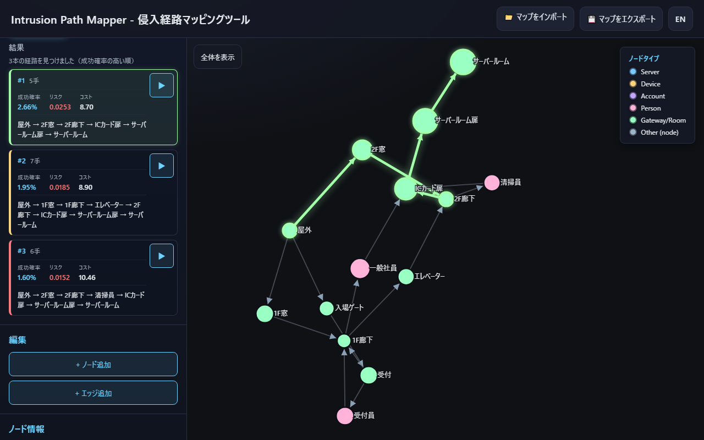
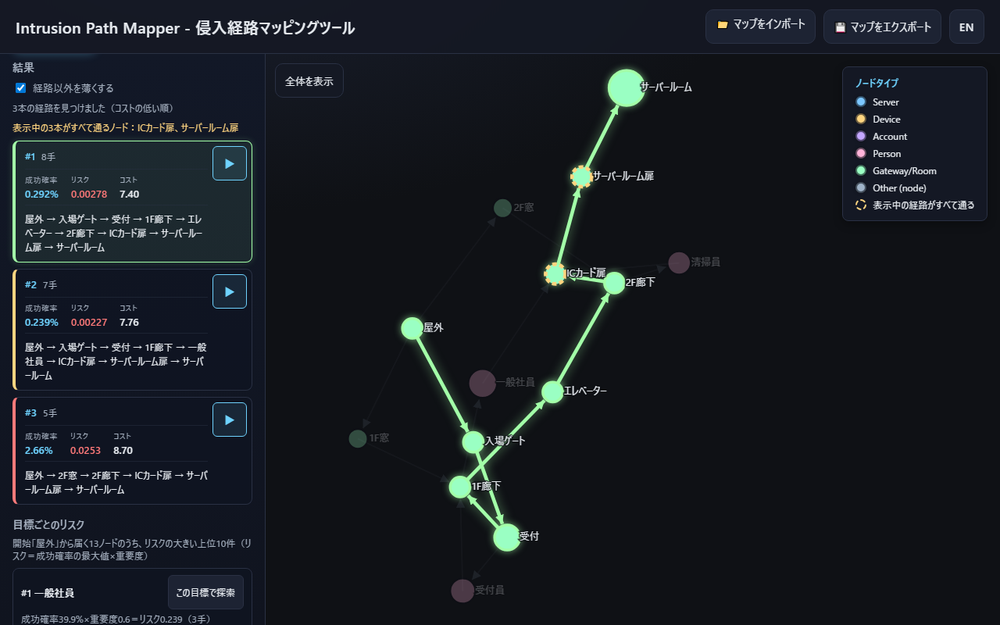
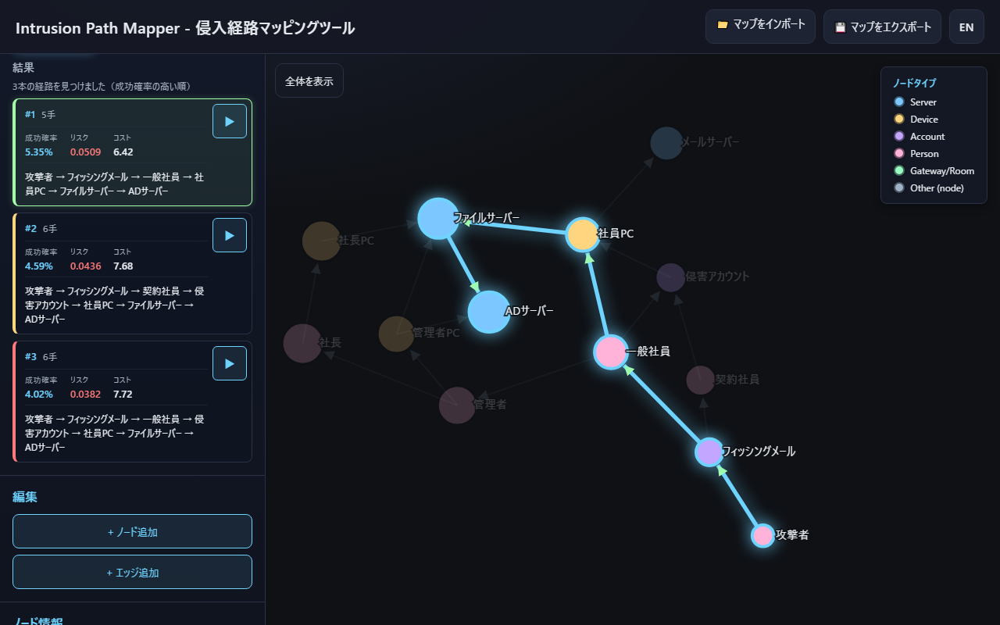
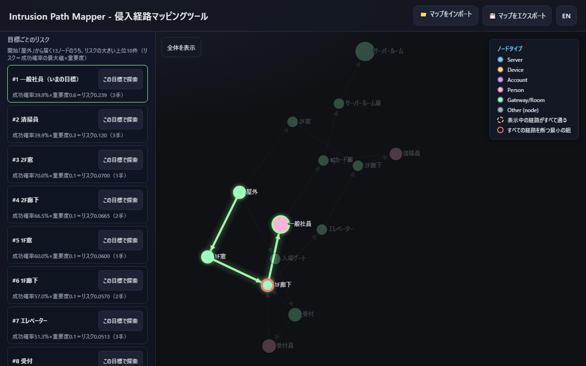
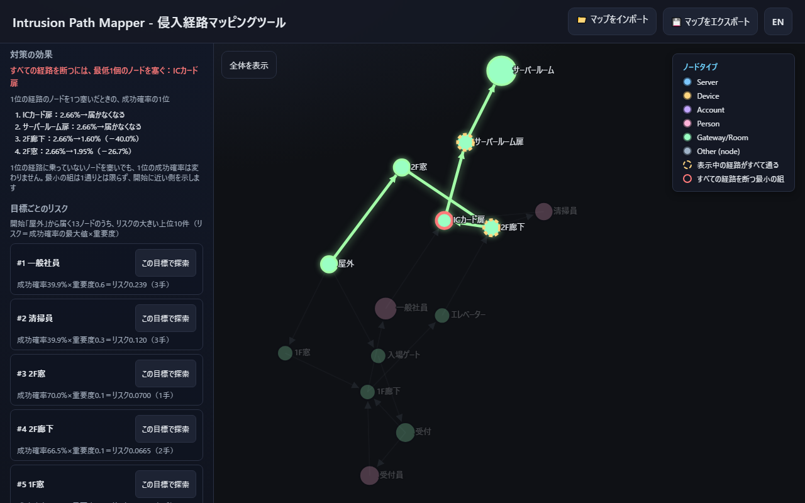
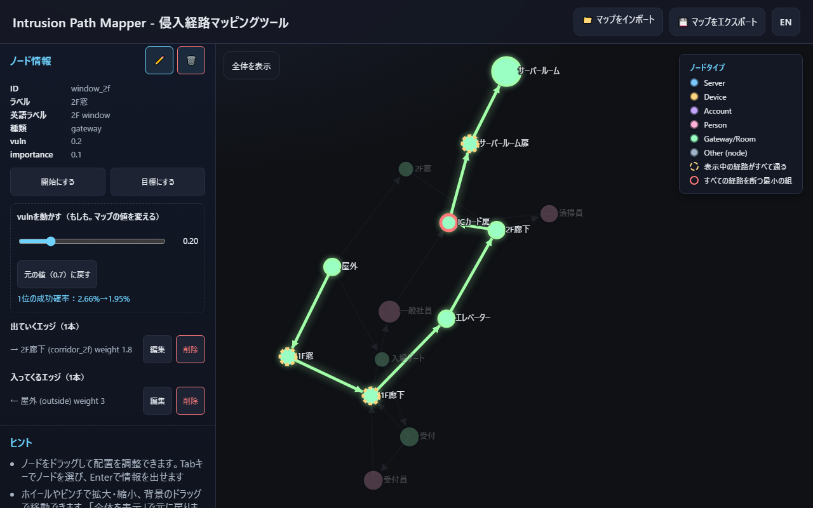

<!--
---
id: day083
slug: intrusion-path-mapper

title: "Intrusion Path Mapper"

subtitle_ja: "侵入経路マッピングツール"
subtitle_en: "Attack Path Visualization & Simulation Tool"

description_ja: "建物やネットワークの簡易マップをノードとエッジで描き、攻撃者の侵入経路をブラウザー上で探索・可視化する教育用ツール。成功確率の高い順（YenのK最短経路）とコストの低い順で経路を並べ、目標ごとのリスク、すべての経路を断つ最小のノードの組（対策の効果）、vulnを動かす「もしも」の試算も示す。日英対応。"
description_en: "Educational tool that maps buildings or networks as nodes and edges and finds intrusion paths in the browser. It ranks paths by success probability (Yen's K shortest paths on −ln vuln) or by cost, compares risk by target, finds the minimum set of nodes that cuts every path, and lets you try what-if changes to vuln. Japanese and English UI."

category_ja:
  - 物理的セキュリティ
  - 攻撃経路分析
  - セキュリティ可視化
category_en:
  - Physical Security
  - Attack Path Analysis
  - Security Visualization

difficulty: 3

tags:
  - attack-path
  - visualization
  - d3
  - graph-algorithm
  - risk-assessment
  - red-team
  - education

repo_url: "https://github.com/ipusiron/intrusion-path-mapper"
demo_url: "https://ipusiron.github.io/intrusion-path-mapper/"

hub: true
---
-->

[English](README.en.md) · 日本語

# Intrusion Path Mapper - 侵入経路マッピングツール


[](https://ipusiron.github.io/intrusion-path-mapper/)

**Day083 - 生成AIで作るセキュリティツール100**

**Intrusion Path Mapper**は、建物やネットワークの簡易マップをノードとエッジで描き、攻撃者の「侵入経路」をブラウザー上で探索・可視化する教育用ツールです。

ノードごとに「突破できる確率」（vuln）を決めると、成功確率の高い順に経路を並べ、各経路の成功確率とリスクを表示します。移動のしやすさ（weight）を重みにしたコストの低い順でも並べられ、2つの順位が食い違う理由を確かめられます。目標ごとのリスクや、すべての経路を断つ最小のノードの組（対策の効果）も求め、vulnを動かしたときの変化をその場で試せます。

物理セキュリティとサイバーセキュリティを1枚のマップにまとめて扱えます。データはブラウザーの中だけで処理し、外部に送信しません。

---

## 🌐 デモページ

👉 **[https://ipusiron.github.io/intrusion-path-mapper/](https://ipusiron.github.io/intrusion-path-mapper/)**

ブラウザーで直接お試しいただけます。

---

## 📸 スクリーンショット

>
>
>*成功確率の高い順。点線の輪は3本すべてが通るノード*

>
>
>*コストの低い順。1位は正面からの経路になる*

>
>
>*経路を再生し終えると、経路外のノードが暗くなる*

>
>
>*目標ごとのリスク。サーバールームより一般社員が上に来る*

>
>
>*対策の効果。ICカード扉1つですべての経路を断てる*

>
>
>*もしも。2F窓を0.2にすると1位が1F窓経由に替わる*

---

## ✨ 機能

- 2つの並べ方で上位K本（1〜10本）の経路を探す
  - 成功確率の高い順（既定）：辺の重みを`−ln(vuln)`にしたYenのK最短経路で、成功確率の積が大きい順に厳密に求める
  - コストの低い順：`weight + ノード難易度の重み × (1 − vuln)`の和が小さい順
- 経路ごとに成功確率・リスク・コスト・手数を表示する（0.0%と丸めず有効数字3桁で表示）
- 選んだ経路をマップ上で強調し、▶ボタンで1手ずつアニメーションする。経路以外は薄くできる
- 表示中の経路がすべて通るノードを点線の輪で示し、結果の欄に並べる
- 目標ごとのリスク：開始ノードから届く各ノードについて、成功確率の最大値×重要度を求め、上位10件を並べる（いまの目標は11位以下でも末尾に出す）
- 対策の効果：すべての経路を断つ最小のノードの組（最小頂点カット）を赤い輪で示し、1位の経路のノードを1つ塞いだときの成功確率の1位を並べる
- もしも：ノードのvulnをスライダーで動かすと、経路・対策の効果・目標ごとのリスクをその場で計算し直し、1位の成功確率の変化を示す（元の値に戻せる）
- ノードとエッジをブラウザー上で追加・編集・削除できる（ノードは種類・vuln・importance・色・英語ラベル、エッジはweight。逆向きのエッジも一度に足せる）
- JSONでインポート・エクスポートできる（読み込み時に検証し、直した箇所を知らせる）
- 4種類のプリセットシナリオ（施設侵入、オフィスネットワーク、物理侵入、ソーシャルエンジニアリング）
- ホイールやピンチで拡大・縮小、背景のドラッグで移動、「全体を表示」で全体が収まる縮尺に戻す
- 日本語と英語の切り替え（サンプルのノードにも英語ラベルがある）
- キーボード操作（Tabでノードを選び、Enterで情報を出す。Escでポップアップとダイアログを閉じる）
- 幅320pxのスマートフォンでも横にはみ出さない

---

## 📖 使い方

### 基本の流れ

1. マップを用意する
   - 「プリセット選択」でシナリオを選び、「プリセット読込」を押す
   - または「📁 マップをインポート」で自分のJSONファイルを読み込む
2. 経路を探す
   - 「初期侵入点」（攻撃の開始地点）と「攻撃目標」を選ぶ
   - 「並べ方」と「経路の数K」を決める（コスト順では「ノード難易度の重み」も使う）
   - 「経路を探索」を押す
3. 結果を見る
   - 経路をクリックすると、マップ上で強調される（「経路以外を薄くする」でほかを薄くする）
   - 点線の輪のノードは、表示中の経路がすべて通る
   - ▶ボタンで、開始から目標まで1手ずつ再生する
   - 「対策の効果」で、すべての経路を断つ最小の組と、1つ塞いだときの効果を見る
   - 「目標ごとのリスク」で、ほかのノードを目標にしたときのリスクを比べ、「この目標で探索」で目標を切り替える
   - ノード情報のスライダーでvulnを動かし、1位の成功確率の変化を見る（マップの値が変わる。「元の値に戻す」で戻る）
4. マップを直す（任意）
   - 「+ ノード追加」「+ エッジ追加」で要素を足す（「逆向きのエッジも追加する」で双方向のエッジになる）
   - ノードをクリックして「✏️」で編集、「🗑️」で削除する。ノード情報の「開始にする」「目標にする」で選択欄に入れられる
   - エッジは、マップの線をクリックするか、ノード情報の「出ていくエッジ」「入ってくるエッジ」の一覧から編集・削除する
   - 「💾 マップをエクスポート」でJSONに保存する

マップを書き換えると、それまでの結果は消えます（古い経路は新しいマップと合わないため）。言語を切り替えたときは、結果を計算し直さずに表示の言語だけを変えます。

### ローカルで動かす

ESモジュールを使うので、`file://`で開くと動きません。HTTPで配信してください。

```bash
git clone https://github.com/ipusiron/intrusion-path-mapper.git
cd intrusion-path-mapper
python -m http.server 8000
```

ブラウザーで`http://localhost:8000/`を開きます。言語は`?lang=ja`か`?lang=en`で指定できます。

---

## 📐 画面構成

| 場所 | 内容 |
|---|---|
| ヘッダー | インポート・エクスポート・言語の切り替え |
| サイドバー | プリセット選択、解析設定と結果、編集、ノード情報、ヒント |
| マップ | ノードとエッジ、凡例、「全体を表示」ボタン、ノードのポップアップ |

幅が860px以下のときは1列になり、マップを上、サイドバーを下に置きます。広い画面では、マップを表示したままサイドバーだけをスクロールできます。

---

## 🔬 技術的な説明

### vulnと成功確率

ノードの`vuln`は「手前のノードにいる攻撃者が、そのノードを突破（通過・掌握）できる確率」です。攻撃者はすでに開始ノードにいるので、開始ノードのvulnは数えません。

- 成功確率＝開始ノードを除く経路上のノードのvulnの積
- 例：開始ノードからvuln 0.8のノードを3つたどると、0.8×0.8×0.8＝51.2%
- 各ノードの突破は互いに独立と仮定している

vulnの目安は次のとおりです（数値は説明用の目安）。

| vuln | 目安 |
|---|---|
| 1.00 | 出発点（攻撃者がすでにいる場所） |
| 0.90〜0.95 | 誰でも通れる通路・開放エリア（廊下・ロビー・エレベーター） |
| 0.50〜0.80 | 認証や施錠はあるが、すり抜けの例が多いもの（共連れ・フィッシング） |
| 0.20〜0.40 | 強い防御（サーバールームの扉、ADサーバー） |
| 0 | 通れない（成功確率順では経路に使わない） |

### リスク

リスク＝成功確率×目標ノードのimportance（可能性×影響）です。importanceは「そのノードを掌握されたときの損害」で、扉や窓のような通り道は低くします。同じ目標への経路どうしでは成功確率と同じ順になるので、目標を変えて比べるときに使います。

### 目標ごとのリスク

開始ノードから各ノードへの成功確率の最大値は、`−ln(vuln)`を重みにしたDijkstra法を1回実行すると、すべてのノードについて同時に求まります。これに各ノードのimportanceを掛け、リスクの大きい順に並べます。物理的侵入経路（屋外から）では、1位は一般社員（39.9%×0.6＝0.239）で、最も重要なサーバールーム（2.66%×0.95＝0.0253）は11位です。

### 2つの並べ方

成功確率は積なので、そのままでは最短経路のアルゴリズムに載りません。積の対数は和になるので、辺の重みを「行き先のノードの`−ln(vuln)`」にすると、重みの和が最小の経路が成功確率の最大の経路になります。これをYenのアルゴリズムで上位K本まで求めます。

コストの低い順では、辺の重みを「`weight + ノード難易度の重み × (1 − 行き先のvuln)`」にします。移動のしやすさ（weight）と突破のしやすさを足し合わせた目安で、成功確率とは別の量です。

2つの順位は食い違うことがあります。物理的侵入経路（既定の開始と目標、K=3）では、コストの低い順の1位は正面から入る経路（屋外→入場ゲート→受付→1F廊下→エレベーター→2F廊下→ICカード扉→サーバールーム扉→サーバールーム、成功確率0.292%）です。成功確率の高い順の1位は2F窓から入る経路（屋外→2F窓→2F廊下→ICカード扉→サーバールーム扉→サーバールーム、2.66%）で、正面の約9倍になります。

### K本の経路（Yenのアルゴリズム）

Yenのアルゴリズム（1971年）は、ループを含まない経路を短い順にK本求めます。1本目をDijkstra法で求め、2本目以降は、前の経路の途中のノードから枝分かれする候補を作って、その中で最も短いものを選びます。Dijkstra法は二分ヒープで実装しています。テストでは、4つのサンプルのすべての開始と目標の組で、全単純経路の総当たりと結果が一致することを確かめています。

### 表示中の経路がすべて通るノード

表示中の経路が2本以上あるとき、開始と目標を除いて、どの経路も通るノードを点線の輪で示します。物理的侵入経路（成功確率の高い順）では、K=3で2F廊下・ICカード扉・サーバールーム扉、K=5とK=10でICカード扉・サーバールーム扉です。表示中のK本についての結果なので、そこを塞げばすべての経路が断たれるとは限りません（すべての経路を断つ組は次の「対策の効果」で求めます）。

### 対策の効果（1つ塞ぐ・最小頂点カット）

1位の経路の途中のノードを1つずつ塞ぎ、そのときの成功確率の1位を並べます。1位の経路に乗っていないノードを塞いでも1位は変わらないので、調べるのは1位の経路の途中のノードだけです。物理的侵入経路では、2F廊下を塞ぐと1位は1.60%（−40.0%）、2F窓では1.95%（−26.7%）になり、ICカード扉かサーバールーム扉を塞ぐと届かなくなります。

すべての経路を断つ最小のノードの組（最小頂点カット）は、ノードを入口と出口に分けて容量1でつなぎ、最大流を求めて得ます（Mengerの定理により、ノードを共有しない経路の最大本数と、断つのに要るノードの最小個数は等しくなります）。最小の組は1通りとは限らないので、開始に近い側を示します。4つのサンプルではどれも1個で、施設侵入は玄関、オフィスネットワーク攻撃はファイアウォール、物理的侵入経路はICカード扉、ソーシャルエンジニアリングはフィッシングメールです。

### もしも（vulnを動かす）

ノード情報のスライダーでvulnを動かすと、直前の探索の条件（開始・目標・並べ方・K）で、経路・対策の効果・目標ごとのリスクを計算し直し、「1位の成功確率：元→いま」を示します。物理的侵入経路で2F窓のvulnを0.7から0.2にすると、1位は屋外→1F窓→1F廊下→エレベーター→2F廊下→ICカード扉→サーバールーム扉→サーバールームに替わり、成功確率は2.66%から1.95%になります。マップに入っている値を書き換える操作なので、エクスポートにも入ります。「元の値に戻す」で戻せます。

### プリセットシナリオ

既定の開始は「入ってくるエッジのないノード」、目標は`attack_goals`の先頭です。成功確率は、成功確率の高い順の1位の経路の値です。

| シナリオ | ノード | エッジ | 開始→目標 | 成功確率の1位 |
|---|---|---|---|---|
| 施設侵入（シンプル） | 6 | 6 | ext→srv1 | 5.85% |
| オフィスネットワーク攻撃 | 10 | 14 | internet→ad_server | 1.57% |
| 物理的侵入経路 | 14 | 18 | outside→server_room | 2.66% |
| ソーシャルエンジニアリング | 13 | 17 | attacker→ad_server | 5.35% |

### JSONフォーマット

```json
{
  "meta": { "title": "Sample Facility", "author": "ipusiron", "created_at": "2025-10-01" },
  "nodes": [
    { "id": "ext",  "type": "gateway", "label": "外部", "label_en": "Outside", "vuln": 1.0, "importance": 0.1 },
    { "id": "srv1", "type": "server",  "label": "ファイルサーバー", "label_en": "File server", "vuln": 0.5, "importance": 0.9 }
  ],
  "edges": [
    { "source": "ext", "target": "srv1", "weight": 1.2 }
  ],
  "attack_goals": ["srv1"]
}
```

ノード（nodes）
- `id`（必須）：英数字・アンダースコア・ハイフンの1〜100文字。重複は不可
- `label`：表示名（200文字まで。省略するとid）
- `label_en`：英語表示のときの名前（任意、200文字まで）
- `type`：`gateway`・`device`・`server`・`account`・`room`・`person`・`node`。英小文字・数字・`_`・`-`の独自の種類も使える（色は`node`と同じ）
- `vuln`：突破できる確率（0〜1、省略すると0.5）
- `importance`：掌握されたときの損害（資産としての価値。0〜1、省略すると0.5。扉や窓のような通り道は低くする）
- `color`（任意）：`#rrggbb`の形のカスタム色

エッジ（edges）
- `source`・`target`（必須）：ノードのid。向きがある（sourceからtargetへ進める）
- `weight`：移動コスト（0以上、省略すると1）。コスト順で使う

その他
- `meta`：`title`・`title_en`・`author`・`created_at`（各200文字まで）
- `attack_goals`：既定の目標にするノードのid（先頭を使う）

読み込みの上限は、ファイル5MB、ノード1,000、エッジ5,000です。IDの形が不正・重複・ラベルが長すぎる・JSONとして読めないファイルは読み込みません。範囲外のvuln・負のweight・存在しないノードへのエッジ・自分自身へのエッジ・重複したエッジは、直したり捨てたりしたうえで読み込み、直した箇所を画面上部に表示します。エクスポートしたファイルは、そのまま読み込み直せます。

### ノードの種類と値の例

| 種類 | 色 | 表すもの | 例（vulnの目安） |
|---|---|---|---|
| gateway | 緑 | 外部との境界・入口 | インターネット（出発点、1.00）、ファイアウォール（0.25）、無線AP（0.70）、VPNゲートウェイ（0.35）、窓（0.60） |
| device | 黄 | 端末 | 営業部PC（0.80）、経理部PC（0.70）、社長PC（0.40）、受付端末（0.75）、IoT機器（0.85） |
| server | 青 | サーバー・クラウドサービス | ファイルサーバー（0.50）、ADサーバー（0.30）、DBサーバー（0.35）、Webサーバー（0.55） |
| account | 紫 | アカウント・認証情報 | ドメイン管理者（0.40）、共有アカウント（0.80）、APIキー（0.70）、SSH秘密鍵（0.55） |
| room | 緑 | 部屋・通路 | 廊下（0.95）、ロビー（0.90）、エレベーター（0.90）、ICカード扉（0.50）、サーバールーム扉（0.40） |
| person | 桃 | 人（ソーシャルエンジニアリングの対象） | 攻撃者（出発点、1.00）、受付員（0.60）、清掃員（0.60）、一般社員（0.70）、社長（0.40） |
| node | 灰 | そのほか | 独自の種類もこの色になる |

エッジのweightは、0.5＝開放されていて容易、1.0＝標準、2.0＝多要素認証や物理的な障壁、5.0＝厳重な警備、を目安にしてください。

---

## 🎯 ユースケース

このツールならではの使い方
- 「安い経路」と「通りやすい経路」を並べて議論する：施設の担当者や学生が、同じマップをコストの低い順と成功確率の高い順で並べ、1位が入れ替わる理由を話し合う。物理的侵入経路では、正面から入る経路（成功確率0.292%）より2F窓からの経路（2.66%）が約9倍通りやすい
- 見張りを1カ所だけ置くなら：自宅や小さな事務所の見取り図を描き、「対策の効果」の最小の組と、Kを増やしても残る点線の輪を見る。物理的侵入経路では、最小の組はICカード扉1つで、K=10でもICカード扉とサーバールーム扉が残り、どちらもカメラや警報を1つだけ置く場所の候補になる（最小の組は1通りとは限らない）
- 攻撃経路を依存の経路に読み替えて、単一障害点を探す：決裁の流れ（申請→課長→部長→経理）や部品の供給（部品→工場→倉庫→店舗）をノードにし、vulnに「その段階が機能している確率」を入れる。成功確率は最後まで届く確率、点線の輪は止まると全体が止まる単一障害点として読める（止まり方は互いに独立と仮定し、容量や時間は扱わない）
- 防御予算ゲーム（机上演習）：攻撃側がマップを作り、防御側は「vulnを0.1下げるごとに1点」で10点の予算を配る。もしものスライダーで下げるたびに「1位の成功確率：元→いま」が変わるので、目標への成功確率の1位をどこまで下げられたかを競い、1本を固めると別の経路が1位に上がる様子を体験する。「対策の効果」の1つ塞いだときの表は、どこに予算を置くかの手がかりになる
- 最も危ないのは最も重要な資産とは限らない：目標ごとのリスクで、守る順番を決める。物理的侵入経路（屋外から）では、届きやすい一般社員（39.9%×0.6＝0.239）が1位で、最も重要なサーバールーム（2.66%×0.95＝0.0253）は11位になる。設備より人への研修を先にする、という議論の材料になる
- 情報量で読む：`−ln(vuln)`は、確率vulnで起きる事象の自己情報量（単位はナット）である。成功確率の高い順の1位は「驚きの合計」が最も小さい経路と読める。物理的侵入経路の1位は合計3.63ナット（5.23ビット）で、そのうち最後の1手（サーバールーム、vuln 0.2）が1.61ナットを占める。[InfoQuantity Academy](https://ipusiron.github.io/infoquantity-academy/)（Day073）で自己情報量を学んでから試すと、2つの考え方のつながりが見える

教育
- 情報セキュリティの授業で、学生が校舎の見取り図をノードとエッジに直し、「いちばん安く入れる経路」と「いちばん成功しやすい経路」が別になる理由を、確率の積で説明する
- アルゴリズムの授業で、Yenのアルゴリズムが出すK本の経路と、積を和に変える対数の考え方を、手計算とツールの結果を並べて確かめる
- 確率の授業で、独立な事象の積が手数とともに急に小さくなることを、手数の違う経路の成功確率から読み取る

仕事（セキュリティ以外）
- 施設管理や総務の担当者が、来客・清掃・搬入の動線を描き、受付や扉のvulnを変えたときに最も通りやすい経路がどこへ移るかを比べ、警備の配置を話し合う材料にする（数値は担当者の見積もりで、現地の評価の代わりにはならない）
- 内部監査やリスク管理の担当者が、申請から支払いまでの承認の流れをノードにして、不正が通りうる経路の候補を洗い出す

暮らし・家庭
- 自宅の防犯を見直すときに、玄関・窓・勝手口・ベランダをノードにして、補助錠を足す（vulnを下げる）と最も入りやすい経路がどこへ移るかを家族で確かめる
- 家族のメール・クラウド・スマートフォンのアカウントのつながりを描き、メールが乗っ取られたらどこまで届くかを見て、二段階認証を付ける順番を決める

趣味・創作
- ミステリーや脱出ゲームのシナリオ作りで、館の見取り図から侵入経路の候補を並べ、読者やプレイヤーが気づきにくい抜け道を検討する
- TRPGやボードゲームのダンジョン設計で、通りやすい道と難所の置き方を、成功確率を見ながら調整する

研究・調べもの
- 攻撃グラフの研究の入門として、論文のモデルを小さなJSONに落とし、経路の数え方や順位の付け方を試す
- エクスポートしたJSONをPythonのNetworkXなどに読み込み、同じ経路と成功確率が出るかを自分の計算で確かめる

ほかのツールとの組み合わせ
- [Asset Inventory Helper](https://ipusiron.github.io/asset-inventory-helper/)（Day059）で洗い出した資産をノードにして、重要な資産までの経路を確かめる
- [Port Scan Visualizer](https://ipusiron.github.io/port-scan-visualizer/)（Day062）でポートとサービスの見え方を学んだあと、外部からサーバーまでの経路をマップにする
- [Physical Key Ledger](https://ipusiron.github.io/physical-key-ledger/)（Day087）で管理している鍵と扉を、物理侵入のマップのノードとvulnに写す

限界
- 確率はノードごとに独立と仮定している。実際には、1つの認証情報で複数の扉が開くなど、突破は連動しうる
- vuln・importance・weightは使う人の見積もりで、ツールは数値の正しさを保証しない
- 検知されるまでの時間や警備の到着など、時間の要素は扱わない

---

## 🧪 テスト

```bash
npm test
```

- Node.js 22以上で動く。依存パッケージはない（`node --test`）
- GitHub Actionsで、pushとpull requestのたびに実行する
- 計算部（`js/ipm-core.js`）：検証と正規化、エクスポートと再読み込みの往復、Yenのアルゴリズムと全単純経路の総当たりの一致（コスト順・成功確率順）、目標ごとのリスクと総当たりの一致、1つ塞いだときの成功確率と総当たりの一致、最小頂点カットの最小性（全サンプルの全組）、エッジの追加・変更・削除、指標と表示の桁
- 画面と文書：CSPとHTMLの構造、自己ホストしたD3のSHA-256、配色のコントラスト（4.5:1以上）、日英の辞書の一致と英語の文言に日本語がないこと、READMEの数値とディレクトリー構造

---

## 🔒 セキュリティ

- meta要素のCSPで、スクリプト・スタイル・接続先を同じオリジン（`'self'`）だけに限っている（`'unsafe-inline'`なし）
- D3.js 7.9.0は`vendor/d3/`に自己ホストしている（外部のCDNに頼らない。テストでファイルのSHA-256を確かめる）
- 読み込んだラベルやIDは`textContent`で描画する（HTMLとして解釈しない）
- インポートしたJSONは、IDの形・重複・長さ・数値の範囲・件数を検証してから使う
- 外部への送信はない。ブラウザーに保存するのは言語の選択（localStorage）だけ
- `referrer`は`no-referrer`、外部へのリンクは`noopener noreferrer`

限界
- GitHub Pagesはレスポンスヘッダーを設定できない。meta要素のCSPでは`frame-ancestors`が無視されるので、ほかのサイトの枠（iframe）に入れられることは防げない
- 信頼できない人から受け取ったJSONは、読み込む前に中身を確かめる

---

## ⚠️ 注意

- 本ツールは教育・検討の補助です。実際の組織のセキュリティ評価の代わりにはなりません
- 実在する組織・施設・ネットワークの詳しい構成や機密情報は入力しないでください。マップを共有するときは、ラベルに個人名や部屋番号を入れないなどの配慮をしてください
- 作者は、本ツールを使った他人のシステムや施設への不正な侵入を勧めません
- 本ツールの使用で生じた損害について、開発者は責任を負いません

---

## 🔗 参考

- Jin Y. Yen, "Finding the K Shortest Loopless Paths in a Network," Management Science, Vol. 17, No. 11, pp. 712-716, 1971
- NIST SP 800-30 Rev. 1, "Guide for Conducting Risk Assessments," 2012（リスクを可能性と影響から決める考え方）
- Oleg Sheyner, Joshua Haines, Somesh Jha, Richard Lippmann, Jeannette M. Wing, "Automated Generation and Analysis of Attack Graphs," IEEE Symposium on Security and Privacy, 2002
- [D3.js](https://d3js.org/)（d3-force・d3-drag・d3-zoom）

---

## 👨‍💻 開発者向け情報

内部の実装（計算部のAPI、アルゴリズム、画面の作り）は[DEVELOPER.md](DEVELOPER.md)を参照してください。

---

## 📁 ディレクトリー構造

```
intrusion-path-mapper/
├── .github/                              # GitHubの設定
│   └── workflows/                        # GitHub Actionsのワークフロー
│       └── test.yml                      # pushとpull requestでnpm testを実行
├── assets/                               # スクリーンショット
│   ├── en/                               # 英語の画面（日本語の6枚と同じ状態）
│   │   ├── screenshot.png                # 物理的侵入経路を成功確率の高い順に探索した画面
│   │   ├── screenshot2.png               # 同じマップをコストの低い順に並べた画面
│   │   ├── screenshot3.png               # 経路のアニメーションを再生し終えた画面
│   │   ├── screenshot4.png               # 目標ごとのリスクの一覧
│   │   ├── screenshot5.png               # 対策の効果の欄と、すべての経路を断つ最小の組
│   │   └── screenshot6.png               # もしものスライダーでvulnを下げた画面
│   ├── screenshot.png                    # 物理的侵入経路を成功確率の高い順に探索した画面
│   ├── screenshot2.png                   # 同じマップをコストの低い順に並べた画面
│   ├── screenshot3.png                   # 経路のアニメーションを再生し終えた画面
│   ├── screenshot4.png                   # 目標ごとのリスクの一覧
│   ├── screenshot5.png                   # 対策の効果の欄と、すべての経路を断つ最小の組
│   └── screenshot6.png                   # もしものスライダーでvulnを下げた画面
├── css/                                  # スタイルシート
│   └── style.css                         # 画面の配色・配置・レスポンシブ
├── js/                                   # JavaScript
│   ├── ipm-core.js                       # 計算部（検証・正規化・Yenのアルゴリズム・指標。DOMに触れない）
│   ├── ipm-messages.js                   # 画面の文言（日本語・英語）
│   └── main.js                           # 画面の処理（D3での描画・操作・編集・日英の切り替え）
├── sample-data/                          # プリセットシナリオ
│   ├── sample-facility.json              # 施設侵入（シンプル）
│   ├── sample-office-network.json        # オフィスネットワーク攻撃
│   ├── sample-physical-intrusion.json    # 物理的侵入経路
│   └── sample-social-engineering.json    # ソーシャルエンジニアリング
├── test/                                 # 自動テスト（node --test）
│   ├── contrast.test.js                  # 配色のコントラスト
│   ├── core.test.js                      # 計算部
│   ├── format.test.js                    # 行の長さ・行数・制御文字
│   ├── html.test.js                      # CSP・HTMLの構造・自己ホストのD3
│   ├── i18n.test.js                      # 日英の辞書とサンプルの英語ラベル
│   └── readme.test.js                    # READMEの構造・数値・ディレクトリー構造
├── vendor/                               # 自己ホストしたライブラリー
│   └── d3/                               # D3.js
│       ├── LICENSE                       # D3.jsのライセンス（ISC）
│       └── d3.v7.9.0.min.js              # D3.js 7.9.0
├── .gitattributes                        # vendor/の改行コードを変換しない設定
├── .gitignore                            # Gitで追跡しないファイル
├── .nojekyll                             # GitHub PagesでJekyllを使わない設定
├── CLAUDE.md                             # Claude Code向けの開発メモ
├── DEVELOPER.md                          # 開発者向けドキュメント
├── LICENSE                               # MITライセンス
├── README.en.md                          # 英語版のREADME
├── README.md                             # 本ファイル
├── index.html                            # 画面のHTML
└── package.json                          # npm testの設定（依存なし）
```

---

## 💻 動作環境

- Chrome・Edge・Firefox・Safariの最新版（ESモジュールと`<dialog>`要素に対応したブラウザー）
- HTTPで配信すること（`file://`では動かない）
- テストはNode.js 22以上

---

## 📄 ライセンス

- ソースコードのライセンスは[MIT License](LICENSE)です
- [D3.js](https://d3js.org/)（ISC License、`vendor/d3/LICENSE`）を利用しています

---

## 🛠️ このツールについて

本ツールは、「生成AIで作るセキュリティツール100」プロジェクトの一環として開発されました。
このプロジェクトでは、AIの支援を活用しながら、セキュリティに関連するさまざまなツールを100日間にわたり制作・公開していく取り組みを行っています。

プロジェクトの詳細や他のツールについては、以下のページをご覧ください。

🔗 [https://akademeia.info/?page_id=42163](https://akademeia.info/?page_id=42163)
